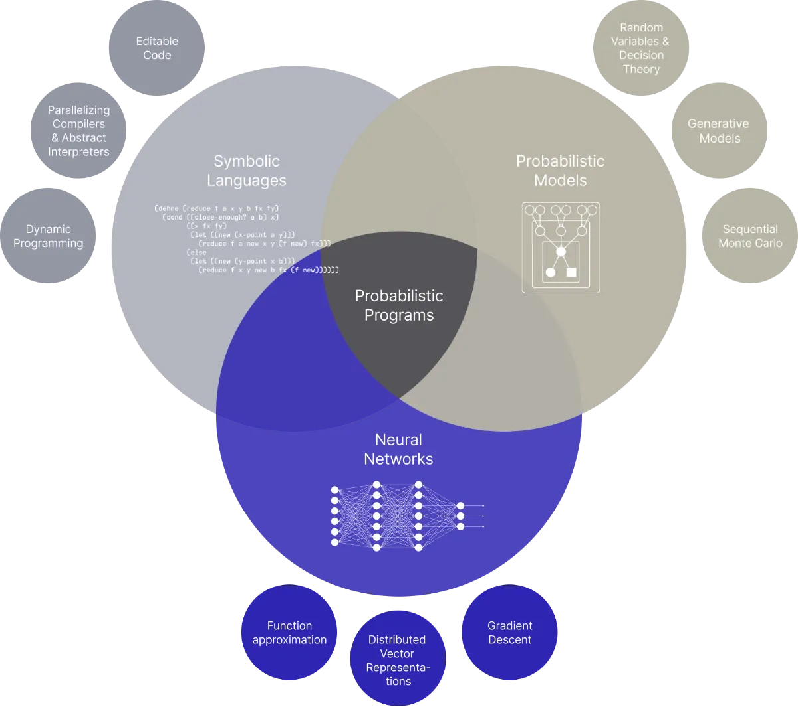

# GenJAX: Probabilistic Programming with Programmable Inference

## Introduction

Probabilistic programming has emerged as a powerful paradigm for building models that reason under uncertainty. In traditional probabilistic ML, practitioners typically handcraft inference algorithms — a laborious and error-prone process that requires deep mathematical expertise. Probabilistic programming changes this: rather than hand-coding complex inference algorithms, practitioners can express their models as programs and let the system handle the mathematical heavy lifting. But here's the catch: general-purpose inference is often too slow, while hand-tuned algorithms are tedious to implement and maintain.

Enter **Gen**—a probabilistic programming system developed by the MIT Probabilistic Computing Project that gives you the best of both worlds: expressive modeling with programmable inference.


*Source: https://jpcca.org/en/probcomp*

## What is Gen?

Gen is an open-source probabilistic programming system that automates the tricky math and low-level implementation details of inference algorithms while giving users the flexibility to customize solutions for their specific models.

Originally built in Julia (as [Gen.jl](https://github.com/probcomp/Gen.jl)), Gen lets you write generative models using ordinary code—including stochastic branching, loops, and recursion—while providing building blocks for constructing efficient inference algorithms.

### Key capabilities:

- **Programmable inference**: Compose inference algorithms (MCMC, SMC, variational inference) tailored to your model's structure—mix Gibbs sampling for discrete variables with HMC for continuous ones
- **Hybrid inference**: Combine neural network proposals with principled Bayesian inference (out of scope for this post, but a key capability for scaling to complex domains)
- **Stochastic structure**: Model problems where the number of latent variables is unknown (e.g., object detection, clustering with unknown K)
- **Programmable trade-offs**: Use high-level abstractions for prototyping, drop down to optimized code for production
- **Clean API**: Automatic differentiation and inference primitives

## Enter GenJAX: GPU-Accelerated Bayesian Inference for Python

**GenJAX** reimplements Gen's core abstractions directly on JAX, bringing principled uncertainty quantification to Python with the performance characteristics production AI demands. For practitioners already working in the Python ecosystem, this means programmable inference without leaving your stack—leveraging JAX's strengths:

- **GPU acceleration**: JIT compilation and automatic batching of inference computations onto GPU devices
- **JAX transformations**: Full compatibility with `jit`, `vmap`, and automatic differentiation
- **Familiar syntax**: Use the `@gen` decorator to define generative functions in Python
- **Built-in algorithms**: Sampling Importance Resampling (SIR) and other inference methods out of the box

### A Quick Taste

In GenJAX, you define generative functions—computational objects representing probability measures over structured sample spaces. These functions can be composed, traced, and used with various inference algorithms:

```python
@gen
def my_model():
    slope = normal(0.0, 1.0) @ "slope"
    intercept = normal(0.0, 1.0) @ "intercept"
    # ... rest of the model
```

## Why This Matters

Traditional probabilistic programming systems offer limited control over inference: you either accept slow, general-purpose algorithms or implement everything from scratch. Gen's **programmable inference** approach lets you compose algorithm components—importance sampling, MCMC kernels, gradient-based methods—to build inference strategies matched to your model's structure.

This is particularly valuable for:

- **Bayesian nonparametric models** with unbounded parameter spaces
- **Structured prediction** where the number of latent variables is itself unknown
- **Scientific modeling** requiring interpretable uncertainty quantification
- **Robotics and perception** systems that must reason about 3D scenes

## Hands-On Example: Bayesian House Price Prediction

Let's put GenJAX to work on a real problem: predicting house prices using the [Kaggle House Prices dataset](https://www.kaggle.com/competitions/house-prices-advanced-regression-techniques). This dataset contains 79 features describing residential homes in Ames, Iowa, with the goal of predicting `SalePrice`.

Instead of a point estimate from traditional regression, we'll build a Bayesian model that gives us **uncertainty quantification**—knowing not just *what* the predicted price is, but *how confident* we should be in that prediction.

### The Problem Setup

The Kaggle dataset includes features like:
- `GrLivArea`: Above-ground living area (square feet)
- `OverallQual`: Overall material and finish quality (1-10)
- `YearBuilt`: Original construction date
- `TotalBsmtSF`: Total basement square footage

For simplicity, we'll focus on a subset of numerical features and build a Bayesian linear regression model.

### Defining the Generative Model

In GenJAX, we express our beliefs about how house prices are generated:

```python
import jax
import jax.numpy as jnp
import jax.random as jrandom
from genjax import gen, normal, uniform, Target, ChoiceMap
from genjax.inference.smc import ImportanceK

@gen
def house_price_model(X):
    """
    Bayesian linear regression for house prices.
    X: feature matrix (n_samples, n_features)
    """
    # Priors on regression coefficients
    # We expect positive coefficients for quality/size features
    coef_0 = normal(0.0, 1.0) @ "coef_0"
    coef_1 = normal(0.0, 1.0) @ "coef_1"
    coef_2 = normal(0.0, 1.0) @ "coef_2"
    coef_3 = normal(0.0, 1.0) @ "coef_3"

    # Prior on intercept (log-scale, since we'll predict log prices)
    intercept = normal(12.0, 1.0) @ "intercept"  # ~$160k baseline

    # Prior on noise (houses vary in price even with same features)
    noise_std = uniform(0.1, 0.5) @ "noise_std"

    # Generate predictions for each house
    coeffs = jnp.array([coef_0, coef_1, coef_2, coef_3])
    predictions = X @ coeffs + intercept

    # Likelihood: observed prices given our linear model
    # GenJAX supports vectorized distributions - the normal distribution
    # broadcasts over the predictions array, treating each as independent
    log_prices = normal(predictions, noise_std) @ "log_prices"

    return predictions
```

This model encodes several assumptions:
1. **Coefficients are uncertain**: We don't know the true relationship, so we place priors
2. **Prices are log-normal**: Prices can't be negative and are right-skewed (we model log prices, making multiplicative effects additive)
3. **Heterogeneous noise**: Even similar houses sell for different prices

> **Note**: The model uses explicit coefficient variables and vectorized likelihood for JAX compatibility. The vectorized `normal(predictions, noise_std)` broadcasts over all samples efficiently. See the [full example code]([../src/house_price_genjax.py](https://github.com/thebongcook/genjax-intro/blob/main/src/house_price_genjax.py)) for the complete implementation.

### Running Inference

Given observed sale prices, we want to infer the posterior distribution over coefficients:

```python
import pandas as pd
import numpy as np

# Load and preprocess data
train_df = pd.read_csv("train.csv")
features = ["GrLivArea", "OverallQual", "YearBuilt", "TotalBsmtSF"]

X = train_df[features].fillna(0).values.astype(np.float32)
y = np.log(train_df["SalePrice"].values).astype(np.float32)

# Standardize features
X_mean, X_std = X.mean(axis=0), X.std(axis=0)
X = (X - X_mean) / X_std

# Convert to JAX arrays
X_train = jnp.array(X)
y_train = y

# Build constraint map with observed prices (vectorized)
constraints = ChoiceMap.d({"log_prices": y_train})

# Create inference target
target = Target(
    house_price_model,
    (X_train,),
    constraints
)

# Run importance sampling with multiple particles
key = jrandom.PRNGKey(42)
k_particles = 1000
alg = ImportanceK(target, k_particles=k_particles)
sub_keys = jrandom.split(key, k_particles)
_, posterior_samples = jax.vmap(alg.random_weighted, in_axes=(0, None))(sub_keys, target)
```

### What We Get: Uncertainty, Not Just Predictions

The beauty of this approach is that we don't get a single coefficient estimate—we get a **distribution**:

```python
# Extract posterior samples for coefficients
coef_samples = posterior_samples["coef_0"]  # GrLivArea coefficient
```

Running the [full example](../src/house_price_genjax.py) on the Kaggle dataset with 1,000 importance sampling particles (using a 70/30 train/test split with 1,021 training samples and 439 test samples) gives us:

```
Posterior estimates for coefficients:
--------------------------------------------------
    GrLivArea      :   0.116 ± 0.247  (95% CI: [-0.346, 0.588])
    OverallQual    :   0.174 ± 0.284  (95% CI: [-0.395, 0.729])
    YearBuilt      :   0.091 ± 0.236  (95% CI: [-0.379, 0.542])
    TotalBsmtSF    :   0.043 ± 0.240  (95% CI: [-0.395, 0.513])
    Intercept      :  12.026 ± 0.197
    Noise Std      :   0.398 ± 0.075

Holdout predictions with uncertainty (test set):
--------------------------------------------------
    Showing 10 of 439 holdout predictions:
    House | Actual Price  | Predicted (Mean) | 90% Credible Interval
    -----------------------------------------------------------------
        1 | $    112,000 | $        97,850 | $    34,101 - $   271,070
        2 | $    123,600 | $       121,401 | $    41,657 - $   355,248
        3 | $    240,000 | $       161,917 | $    47,347 - $   497,824
        4 | $    117,000 | $       116,189 | $    51,273 - $   263,998
        5 | $    281,213 | $       291,776 | $   105,307 - $   835,386
        6 | $    275,500 | $       266,397 | $    99,238 - $   685,142
        7 | $    130,000 | $       122,954 | $    54,602 - $   296,081
        8 | $    345,000 | $       322,223 | $   117,288 - $   957,747
        9 | $    123,000 | $       125,042 | $    54,339 - $   300,636
       10 | $    179,200 | $       187,161 | $    82,738 - $   448,681

Test set summary metrics (all 439 samples):
--------------------------------------------------
    Mean Absolute Error (log prices): 0.1209
    Mean Absolute Error (actual prices): $21,535
    90% Credible Interval coverage: 99.8%
```

Notice how the credible intervals (CI) capture the actual prices—even on held-out data the model has never seen. The high coverage on the credible intervals shows the model provides honest uncertainty quantification that's far more useful for decision-making than a single point estimate.

#### Why Uncertainty Changes Decisions

Consider House 134 vs House 135 from our results:

| House | Predicted | 90% CI | CI Width |
|-------|-----------|--------|----------|
| 134 | $349,954 | $141k - $793k | $651k |
| 135 | $347,868 | $97k - $1,302k | $1,204k |

A point-estimate model would say both houses are worth ~$350k—virtually identical. But with uncertainty quantification, decision-makers see a completely different picture:

**Mortgage lender**: For House 135, the wide interval ($97k-$1.3M) signals high valuation uncertainty—the model's uncertainty reflects how well the observed features explain prices for similar houses in the training data. A lender might require a 25% down payment instead of the standard 20%, or order additional appraisals. For House 134, the tighter interval provides more confidence, allowing standard terms—even though the predicted price is the same.

**Home buyer** (let's assume our home buyer is both data savvy and has access to a lot of housing data of his neighborhood): If both houses are listed at $380k (about 9% above prediction), the uncertainty tells different stories. For House 134, with its tighter CI, $380k sits well within the plausible range—reasonable to proceed. For House 135, with its wide CI ($97k-$1.3M), the same $380k asking price is harder to evaluate—the true value could be much lower *or* the house could actually be a bargain at $380k. Either way, the buyer should investigate further before committing.

**Real estate investor**: What represents risk to a lender can represent opportunity to an investor. House 135's wide uncertainty flags it as a property where the model lacks confidence—potentially due to unique characteristics that create arbitrage opportunities. An investor might prioritize investigating this house to find whether it's mispriced, while House 134's tighter bounds suggest the market has likely priced it correctly.

The key insight: **identical predicted prices with different uncertainty bounds should lead to different actions**. Point estimates hide this crucial information.

### Extending the Model: Handling Outliers

Real estate data often has outliers. Now imagine a 2,000 sqft house in a good neighborhood that our model predicts should sell for $450,000—but it actually sold for $180,000 because it was a foreclosure. Without outlier handling, this single data point would drag our coefficients away from their true values, hurting predictions for all normal sales.

In a traditional workflow, you'd need to derive new inference equations from scratch. But with GenJAX, I can simply extend the model with stochastic branching:

```python
from genjax import switch

# Normal houses: tight Gaussian around prediction
@gen
def inlier_obs(mean, noise_std):
    return normal(mean, noise_std) @ "obs"

# Outliers: broad uniform distribution
@gen
def outlier_obs(mean, noise_std):
    return uniform(10.0, 14.0) @ "obs"

# switch selects branch by index: 0 → inlier_obs, 1 → outlier_obs
obs_model = switch(inlier_obs, outlier_obs)

@gen
def robust_house_price_model(X):
    # ... coefficients and intercept as before ...

    for i in range(X.shape[0]):
        # Is this house an outlier?
        is_outlier = flip(0.05) @ f"outlier_{i}"
        # switch requires integer index; flip returns bool
        idx = is_outlier.astype(jnp.int32)
        log_price = obs_model(idx, (predictions[i], noise_std), (predictions[i], noise_std)) @ f"y_{i}"
```

This is where Gen's programmable inference shines—you can mix Gibbs sampling for the discrete outlier indicators with Hamiltonian Monte Carlo (HMC) for the continuous coefficients.

## Key Takeaways

- **Practical applicability**: As shown in the house price example, GenJAX can tackle real problems while providing honest uncertainty estimates
- **Programmable inference**: Gen lets you control the algorithm while automating the math—combine importance sampling with MCMC kernels as needed
- **Uncertainty quantification**: Instead of point estimates, get full posterior distributions with credible intervals—far more useful for real-world decision-making
- **Expressive modeling**: Handle complex scenarios like outlier detection through stochastic branching, mixing discrete and continuous inference

## Conclusion

Gen represents a shift in how we think about probabilistic programming: instead of treating inference as a black box, it gives practitioners the tools to build custom algorithms tailored to their models. With GenJAX, these capabilities are now accessible to the broader Python/AI community with the performance benefits of JAX.

Whether you're building Bayesian models for scientific research or developing perception systems that need to reason under uncertainty, GenJAX offers a compelling middle ground between flexibility and automation. At Gaudiy, we focus heavily on AI Agents, and probabilistic programming offers a principled framework for quantifying uncertainty in such systems and hence help improve calibration and robustness.

## References

- [Gen Official Website](https://www.gen.dev/)
- [GenJAX Documentation](https://genjax.gen.dev/)
- [GenJAX GitHub Repository](https://github.com/genjax-community/genjax)
- [Gen.jl GitHub Repository](https://github.com/probcomp/Gen.jl)
- [MIT Probabilistic Computing Project](https://github.com/probcomp)
- [Gen Tutorials](https://www.gen.dev/tutorials/)
- [Probability & Probabilistic Computing Tutorial](https://josephausterweil.github.io/probintro/intro/index.html)
- [Kaggle House Prices Competition](https://www.kaggle.com/competitions/house-prices-advanced-regression-techniques)
- [Cusumano-Towner, M. F., Saad, F. A., Lew, A., & Mansinghka, V. K. (2019). Gen: A General-Purpose Probabilistic Programming System with Programmable Inference. PLDI 2019.](https://www.cs.cmu.edu/~fsaad/assets/papers/2019-CusumanoTownerEtAl-PLDI.pdf)
